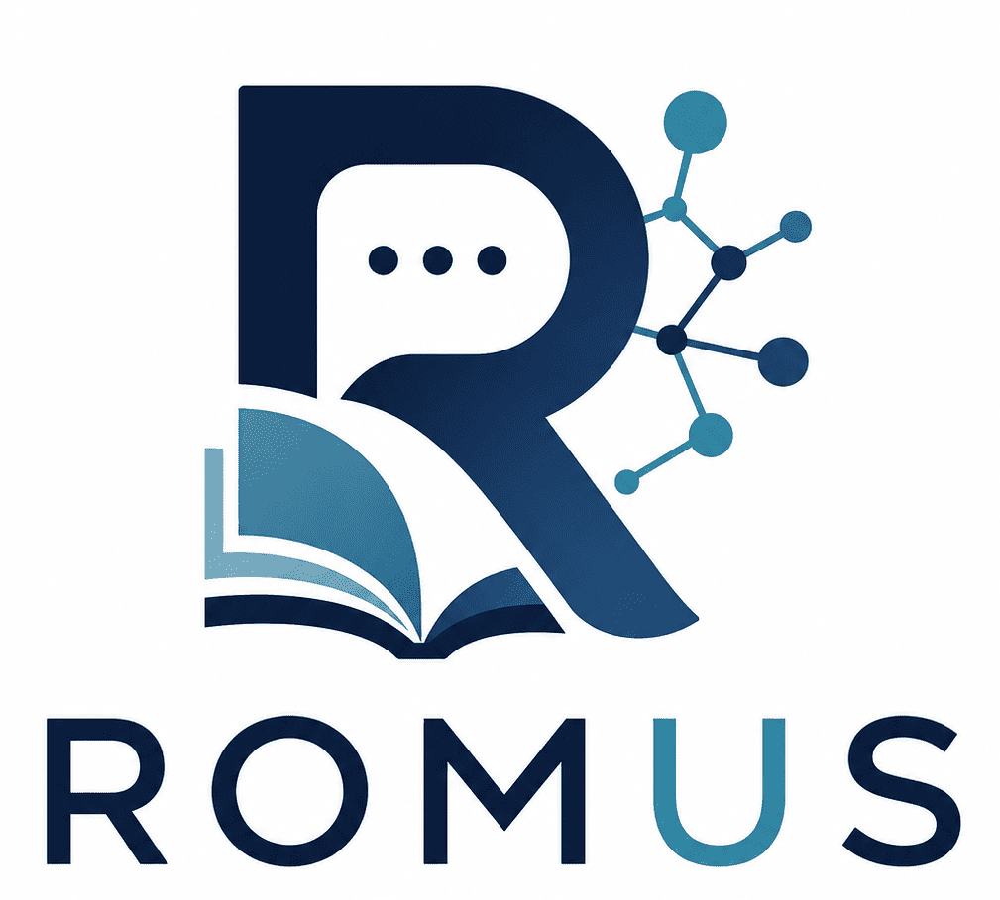

# ROMUS

  

## About

ROMUS is a private virtual assistant developed as a Bachelor's Thesis project at the University of Granada.

The project explores the feasibility of deploying Large Language Models locally while preserving privacy, data ownership and organizational control.

ROMUS combines:

- Local LLM execution through Ollama
- Retrieval-Augmented Generation (RAG)
- ChromaDB vector storage
- FastAPI backend
- React + TypeScript frontend
- Docker-based deployment

## Main Goals

- Keep sensitive information inside controlled infrastructure
- Avoid dependency on external AI providers
- Enable consultation of internal knowledge bases
- Provide traceability through RAG mechanisms

## Repository

Main repository:

https://github.com/ROMUS-UGR/ROMUS

## License

This project is distributed under the GNU General Public License v3.0 (GPLv3).
